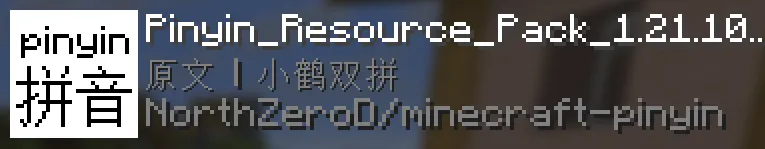
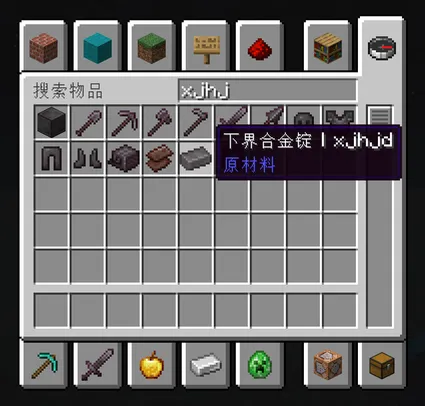
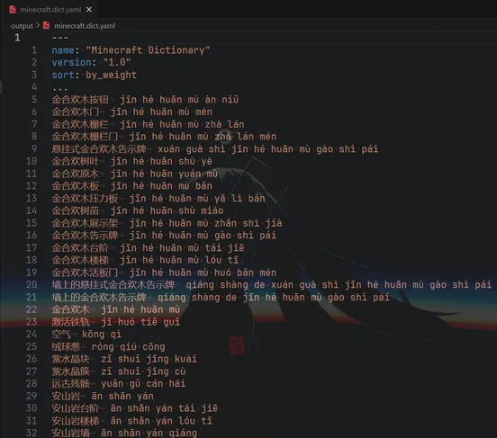
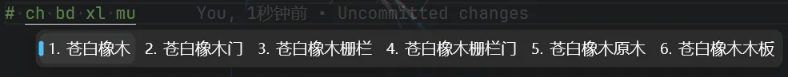

# Minecraft Pinyin

生成 Minecraft **Rime词库**，以及汉语拼音**资源包**，支持全拼、各种双拼和首字母！






当前支持的资源包拼音方案:

- [x] 首字母
- [x] 全拼
- [x] 小鹤双拼
- [x] 自然码
- [x] 搜狗双拼
- [x] 微软双拼
- [x] 紫光双拼
- [X] 国标双拼
- [X] 拼音加加
- [X] 智能ABC
- [ ] 粤拼(港繁)

*积极维护中...*

## 使用

**请确保你的操作系统上已安装 git 和 python，然后再进行下一步。**

或者，下载[源代码压缩包](https://github.com/NorthZeroD/minecraft-pinyin/archive/refs/heads/main.zip)，在项目根目录进行以下操作中的步骤2️⃣。

### Linux

1️⃣ 克隆项目并切换到项目根目录

```bash
git clone https://github.com/NorthZeroD/minecraft-pinyin.git && cd minecraft-pinyin
```

2️⃣ 更改脚本权限并执行

```bash
chmod +x script/run.sh && ./script/run.sh
```

### Windows

1️⃣ 克隆项目并切换到项目根目录

如果使用 **PowerShell 5**:

```bash
git clone https://github.com/NorthZeroD/minecraft-pinyin.git ; cd minecraft-pinyin
```

如果使用 **CMD** 或 **PowerShell 7**:

```bash
git clone https://github.com/NorthZeroD/minecraft-pinyin.git && cd minecraft-pinyin
```

2️⃣ 执行脚本

如果使用 **Powershell**:

```bash
.\script\run.bat
```

如果使用 **CMD**:

```bash
script\run.bat
```
